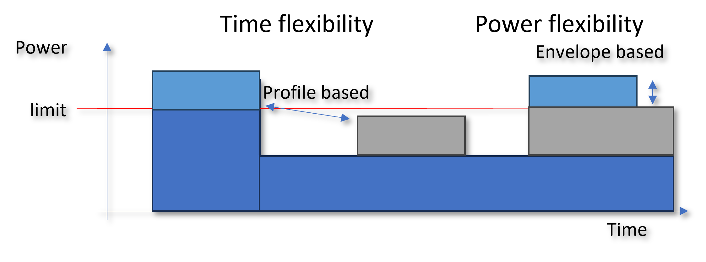
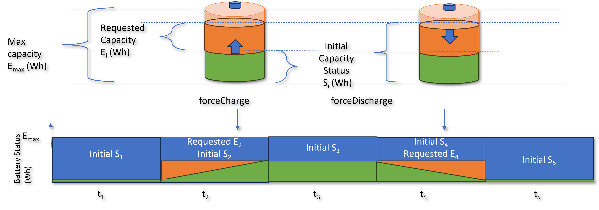

Flexibility overview
---------------------
Energy flexibility can be achieved by moving the time of demand or generation as well as restricting or curtailing the power generated or consumed by energy assets / distributed energy resources.
Time flexibility can be achieved using virtual battery storage or by rescheduling the time of use of demands.
Power flexibility can be achieved by curtailing the demand or generation of flexibile assets such as EV charging.

The virtual battery concept permits the time shifting or peak shaving to be achieved by storing and retrieving of energy in two different time periods; a charge period and a discharge period.
The battery does not need to be a traditional electrochemical battery but could be a building or other heat storage medium with heat pumps or HVAC operating, which can store thermal energy. 

Power limiting or curtailment can be applied to EV charging and other flexible loads by applying limits on the power consumed of produced over network congestion periods.

Digital Twins
-------------

Digital twins are virtual representations of assets which are synchronised, with a certain resolution and fidelity, to the real assets they represent. 
They can provide information related to the capabilities of the assets to provide flexibility, such as flexible energy capacity and degradation and cost efficiency for use in order to provide flexibility.
In this manner the play a key role in supporting efficient flexibility provision in hybrid energy storage systems in which different types of assets are possible to utilise in a combined manner.

More details can be found in:

https://github.com/FlexCHESS/CHESSNode/blob/master/doc/DigitalTwinPaper.pdf
